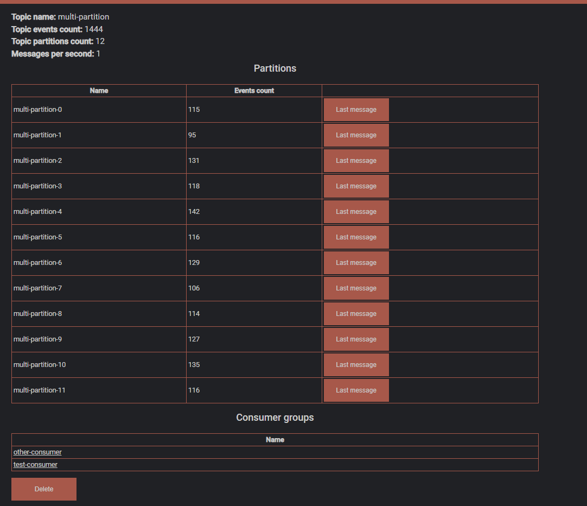
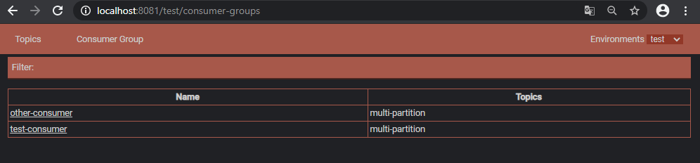
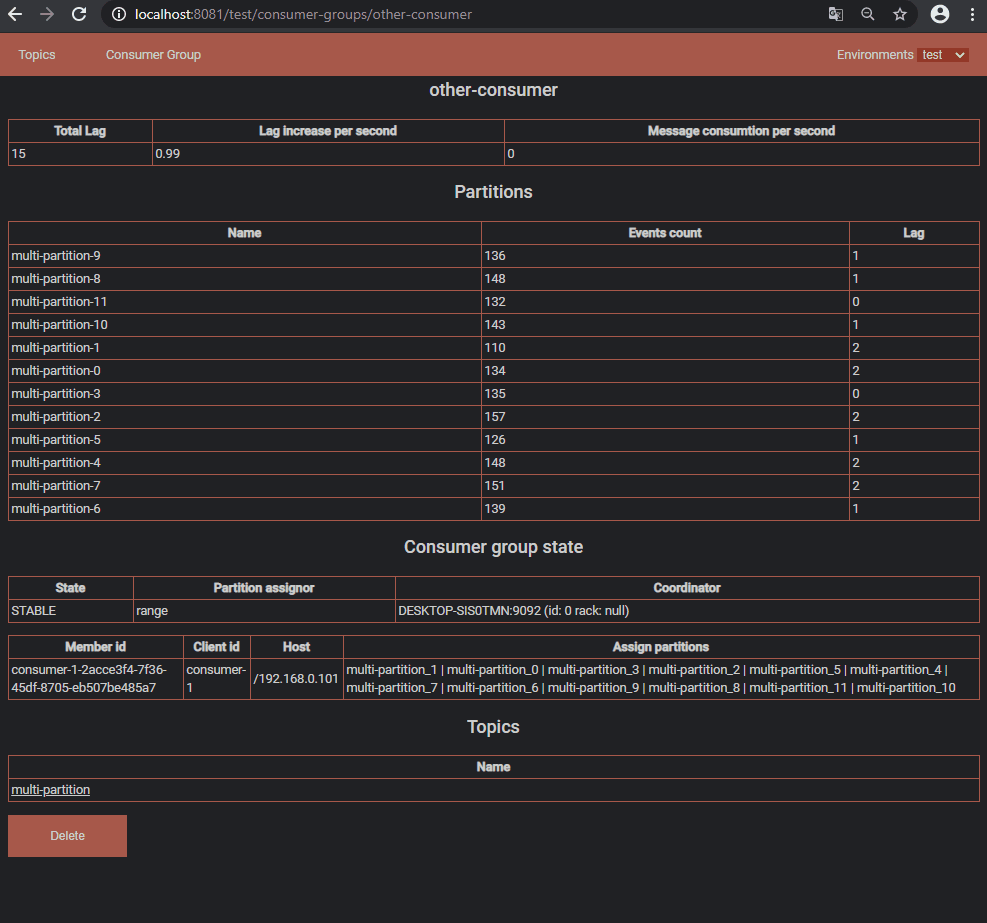
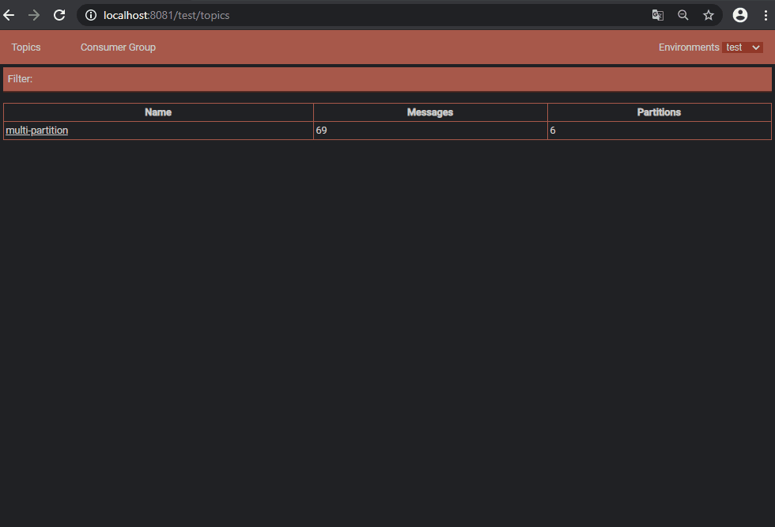
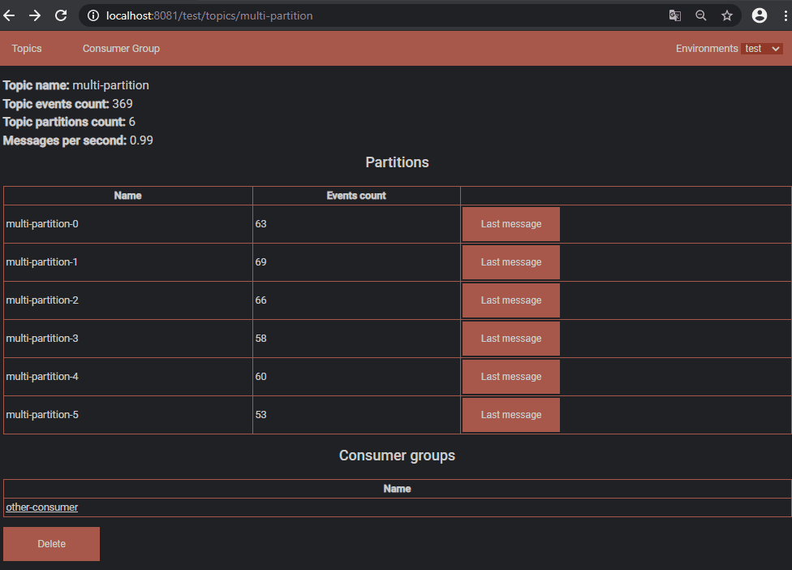
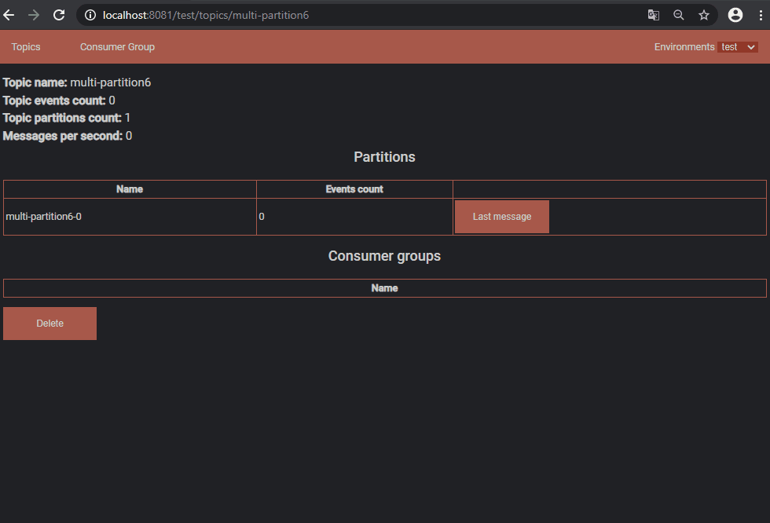

# simple-kafka-browser
Small application for browsering kafka clusters

## Starting application:
Require java 11 or newer.

### Starting application
### Configuration

## Features:
### Topics overview

### Consumer group overview

### Support multiple clusters

### Connections between consumer group and topics

### Removal of consumer groups and topics

## Known issues
- Poor error handling
- Server may not reconnect to kafka claster when connection is lost
- Navigation between cluster can fail

